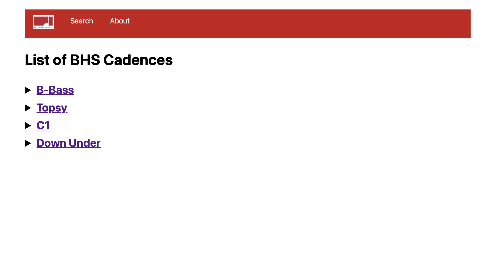
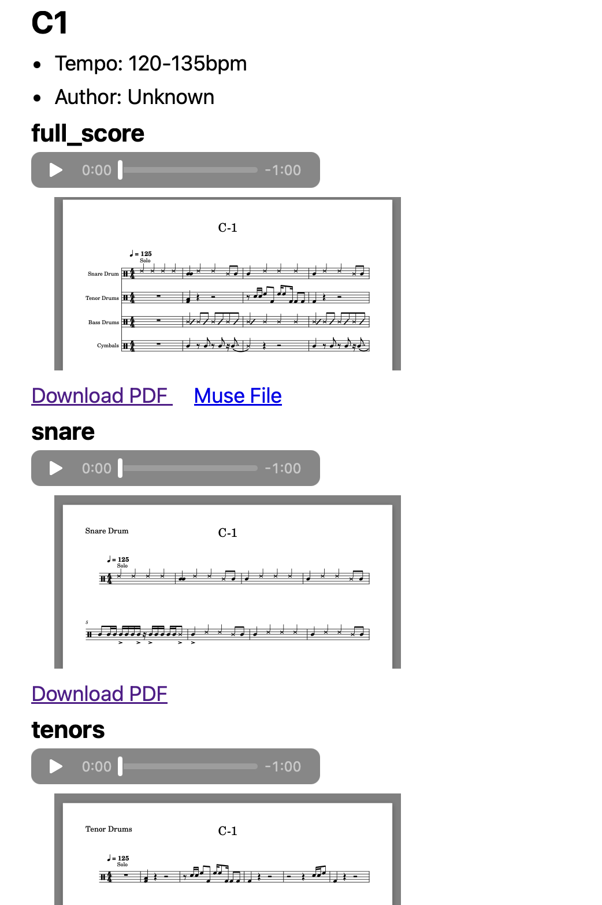

Title: BHS Cadences
Tags: python, website, school

The problem? Incoming freshman and new percussionists didn't know the songs we played for drumline. The solution? Write code to 

[Birb Vs Nuke on Github](https://github.com/iamxallax/bhs-cadences)

[Check it out!](bhs-cadences.fly.dev)

The home page:

The content for a specific cadence:
