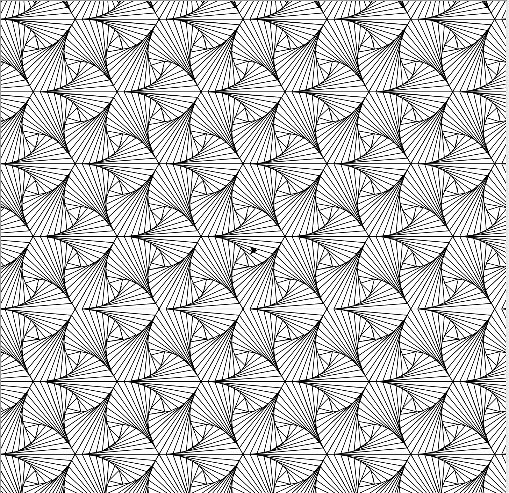
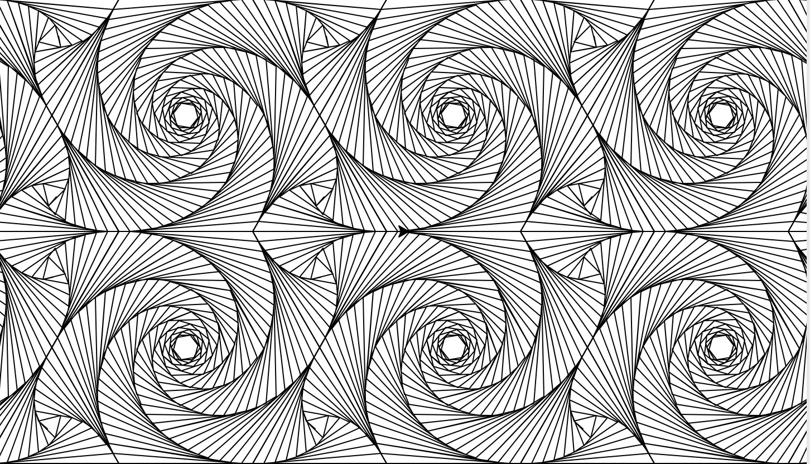

Title: Turtle Tiling
Tags: turtle, graphics, python
Turtle Tiling was a project I made in 8th grade that could make cool patterns out of static shapes. I got the idea after making a similiar piece of artwork for a geometry project, but expanded to include triangles, squares, and hexagons, with the use of trigonometry and other math. This project uses Turtle to draw the shapes by accepting angles and distances, drawing a shape and recursively rotating it to achieve this effect. If you look carefully, you can see the individual shape from the whole!

[Turtle Tiling on Github](https://github.com/xallax-ekacnap/Turtle_Tiling)

## Some pictures from gameplay:
Triangles tiled:

Squares tiled:

Hexagons (and some triangles) tiled:

